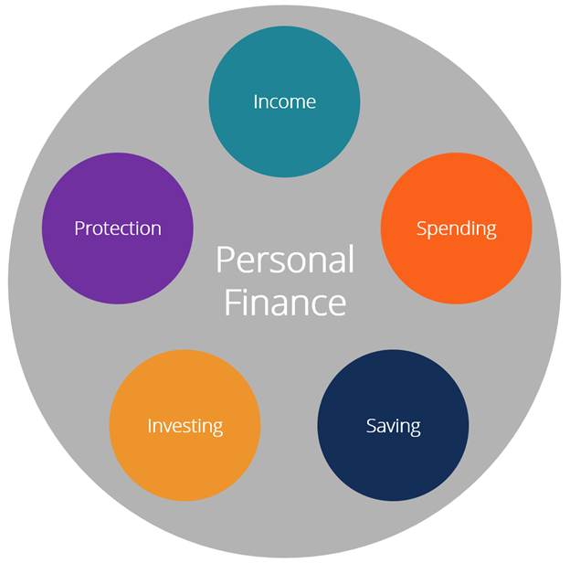

```{r setup, include=FALSE}
knitr::opts_chunk$set(echo = TRUE)
```

# Introduction
What is Personal Finance? It is the term or idea of managing your own money or income by using financial tips by saving, investing, budgeting, insurance, and financial education. Personal Finance has a vast scope because it is not only for saving and spending. Going to the bank and knowing the financial laws and regulations will help avoid unwanted expenses. A person can financially plan for family plan, retirement plan, housing plan, vacation plan. Everything that involves money can be financially planned by the individual. 

What is Financial Literacy? Financial Literacy is the constant learning of financial understanding. This is an ability people must learn to try to achieve financial freedom. There are many skills that are needed to be learned like budgeting, saving, investing, reading financial statements of a company, and business skills. It is the cornerstone for a person’s relationship with handling and dealing with money. 


## Personal Finance Areas
There are 5 Personal finance areas needed to be learnt by a person in order to be financial stable. 



>[5 Personal Finance Areas]()

1. `Protection`

Protection, it means that an individual needs to be always insured (protected) in order to avoid financial loss. Insurance is a way of minimizing the risk of financial expenses due to unexpected situations. There are three insurance a person may invest in life insurance, health insurance and estate planning. This is only for personal finance there are more complicated insurance options for business or corporate purposes.

2. `Investing`

Learning how to invest is no easy task but it will help grow the active income in many ways possible. Investing is when a person will sacrifice his present assets in hopes that it will reap profit. 

What are ways people can invest? People can invest in stocks, bonds, real estate, mutual funds, commodities, private equity, crypto, art, and NFTs. Investing does not always yield a positive return which all investments have risk involved. Do your own research (DYOR) is very important in investing. Following people’s advice may help but fear of missing out also plays a factor. 

Investing is the most intricate aspect of personal finance, and it is also one of the areas where people seek expert help the most. The risk and reward of various assets are vastly varied, and most individuals seek assistance in this part of their financial strategy (Personal finance, 2022).

3. `Saving`

Savings refers to money that hasn't been spent yet, or consumption that has been postponed. Putting money away in a deposit account, a pension account, an investment fund, or as cash are all examples of saving methods. Reducing recurrent costs, for example, is another way to save (Saving, 2021). 

Saving is vital especially for emergencies. Emergency fund is vital in case any accident or job lay off may occur. As people say cash is king it is important to also have liquid assets in case an investment or a business idea comes to mind.

4. `Spending`

Spending your income in utilities, car loans, rent, taxes, food, personal enjoyment, and mortgage. All of the aforementioned expenditures diminish the amount of money available for saving and investing. The individual has a deficit if his or her spending exceed his or her income. It's just as crucial to manage spending as it is to generate revenue, and most individuals have more control over their discretionary expenses than their income. For effective personal money management, appropriate spending habits are essential.


This is an R Markdown document. Markdown is a simple formatting syntax for authoring HTML, PDF, and MS Word documents. For more details on using R Markdown see <http://rmarkdown.rstudio.com>.

When you click the **Knit** button a document will be generated that includes both content as well as the output of any embedded R code chunks within the document. You can embed an R code chunk like this:

```{r cars}
summary(cars)
```

## Including Plots

You can also embed plots, for example:

```{r pressure, echo=FALSE}
plot(pressure)
```

Note that the `echo = FALSE` parameter was added to the code chunk to prevent printing of the R code that generated the plot.
