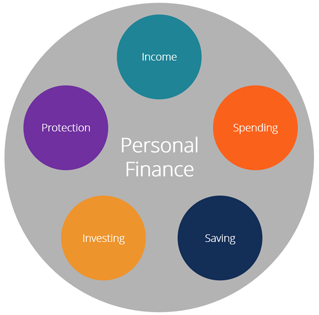

```{r setup, include=FALSE}
knitr::opts_chunk$set(echo = TRUE)
```

# Introduction

## What is Personal Finance? 
It is the term or idea of managing your own money or income by using financial tips by saving, investing, budgeting, insurance, and financial education. Personal Finance has a vast scope because it is not only for saving and spending. Going to the bank and knowing the financial laws and regulations will help avoid unwanted expenses. A person can financially plan for family plan, retirement plan, housing plan, vacation plan. Everything that involves money can be financially planned by the individual. 

## What is Financial Literacy? 
Financial Literacy is the constant learning of financial understanding. This is an ability people must learn to try to achieve financial freedom. There are many skills that are needed to be learned like budgeting, saving, investing, reading financial statements of a company, and business skills. It is the cornerstone for a person’s relationship with handling and dealing with money. 

# Personal Finance Areas
There are [5 Personal finance areas](https://corporatefinanceinstitute.com/resources/knowledge/finance/personal-finance/) needed to be learnt by a person in order to be financial stable. 




## Protection
The first area is protection, it means that an individual needs to be always insured (protected) on order to avoid financial loss. Insurance is a way of minimizing the risk of financial expenses due to unexpected situations. There are three insurance a person may invest in life insurance, health insurance and estate planning. This is only for personal finance there are more complicated insurance options for business or corporate purposes. 

## Investing
The second area is investing. Learning how to invest is no easy task but it will help grow the active income in many ways possible. Investing is when a person to sacrifice his present assets in hopes that it will reap profit. What are ways people can invest? People can invest in stocks, bonds, real estate, mutual funds, commodities, private equity, crypto, art and NFTs. Investing does not always yield a positive return which all investments have risk involved. Do your own research (DYOR) is very important in investing. Following people’s advice may help but fear of missing out also plays a factor. 

Investing is the most intricate aspect of personal finance, and it is also one of the areas where people seek expert help the most. The risk and reward of various assets are vastly varied, and most individuals seek assistance in this part of their financial strategy (Personal finance, 2022).

## Saving
The third area is saving. It refers to money that hasn't been spent yet, or consumption that has been postponed. Putting money away in a deposit account, a pension account, an investment fund, or as cash are all examples of saving methods. Reducing recurrent costs, for example, is another way to save (Saving, 2021). 

Saving is vital especially for emergencies. Emergency fund is vital in case any accident or job lay off may occur. As people say cash is king it is important to also have liquid assets in case an investment or a business idea comes to mind.

## Spending
The fourth area is spending. Spending your income in utilities, car loans, rent, taxes, food, personal enjoyment, and mortgage. All of the aforementioned expenditures diminish the amount of money available for saving and investing. The individual has a deficit if his or her spending exceed his or her income. It's just as crucial to manage spending as it is to generate revenue, and most individuals have more control over their discretionary expenses than their income. For effective personal money management, appropriate spending habits are essential.

## Income
And lastly income, it is the most important area of personal finance because without income no person can survive. They can’t survive because of they have no purchasing power. Some of the ways to have income is to work and dividends. A person can also start a business to increase its income, but a safer way is to work for an established company.  


**The way a person can divide his or her income based on their [risk appetite.](https://www.prulifeuk.com.ph/en/explore-pulse/health-financial-wellness/50-30-20-budgeting-hack/)**

>Aggressive

```{r Aggressive ,echo = FALSE}
x <- c(40, 20, 20, 20)
labels <- c("Investment", "Saving", "Insurance", "Expense")
piepercent<- round(100*x/sum(x), 1)

pie(x,labels = piepercent, main = "Aggressive", col = rainbow(length(x)))
legend("topright", c("Investment", "Saving", "Insurance", "Expense"), cex = 0.8,
   fill = rainbow(length(x)))
# (echo = FALSE)
```

>Passive

```{r Passive ,echo = FALSE}
x <- c(10, 40, 25, 25)
labels <- c("Investment", "Saving", "Insurance", "Expense")
piepercent<- round(100*x/sum(x), 1)

pie(x,labels = piepercent, main = "Aggressive", col = rainbow(length(x)))
legend("topright", c("Investment", "Saving", "Insurance", "Expense"), cex = 0.8,
   fill = rainbow(length(x)))
# (echo = FALSE)
```

# Importance of Financial Literacy
Financial literacy is important for everyone, but especially for the poorer classes, because it will assist them in becoming debt-free. In the Philippines, they say "isang kahig isang tuka," which means they have to labor every day only to feed their stomachs but can't satisfy their desires. Financial literacy in the Philippines is still far behind that of other countries, which impedes the country's economic growth. Financial literacy goes hand in hand with personal finance the more financial literate a person is the better he may become with his personal finances. 

Based on the dataset (3.1 Dataset) the high-income countries are more likely to risk their income compared to the low-income countries. The high-income countries are above the mean (3.2 Mean) which means they would be more likely to risk on the other hand low-income countries are below the mean (3.2 Mean) which means they are less likely to risk. 

## Dataset Visualization
[Financial Literacy Selected Financial Literacy Survey Results](https://data.adb.org/taxonomy/term/125)

```{r}
library(readr)
data <- read.csv("financial-literacy-survey.csv")
print(data)

```


## Mean
Mean Formula:
$$m = \frac {sum of terms} {number of terms}$$

```{r}
x = mean(data$Overall_Ranking)

sprintf("Mean: %.2f", x)
```

## Standard Deviation
Standard Deviation Formula:
$$o = \sqrt{\frac {\sum_(xi - \mu)^2}{N}} $$

```{r}
std = sd(data$Overall_Ranking)

sprintf("Standard Deviation: %.2f", std)
```

## Graphs

>Dot Chart for Each Questions on Survey from Dataset

```{r}
dot <- read.csv("financial-literacy-survey.csv")
dotchart(dot$Q1..Compound.Interest, labels = dot$Country, main = "Compound Interest") #Q1
dotchart(dot$Q2..Inflation, labels = dot$Country, main = "Inflation") #Q2
dotchart(dot$Q3..Risk.Diversification, labels = dot$Country, main = "RiskDiversification") #Q3

```

>Bar Plot

<!-- Made the line of codes into comment since result of the bar plot is not expanded
    Furthermore, the image figure shows is still from the codes written but exported
    The exported image provides more information than the default result of the bar plot-->
`barplot(data$Overall_Ranking, `
        `main = "Overall Ranking by Countries", `
        `xlab = "Country", `
        `ylab = "Overall Ranking", `
        `names = data$Country)`


Despite New Zealand placing the highest in terms of rankings for Q1: Compound Interest, and Q2: Inflation, Germany is still held as the top for the overall ranking because of the balanced answers for each questions.

# Relation per Capita GDP Adult Deposit
[View dataset Here!](https://data.adb.org/taxonomy/term/125)
The relation of per capita and adults with accounts in formal financial institutions may be interpreted as the financial literacy rate of a highly developed country to a third world country. 

## Dataset Visualization
```{r}
library(readr)
data2 <- read.csv("relation-per-capita-GDP-adult-deposit.csv")
head(data, 5)
```

## Data
Mean Formula:
$$m = \frac {sum of terms} {number of terms}$$
```{r summary}
summary(data2)
```
## Mean
Mean Formula:
$$m = \frac {sum of terms} {number of terms}$$
```{r}
x = mean(data2$Log.of.GDP.per.capita)

sprintf("Mean: %.2f", x)
```

## Standard Deviation
Standard Deviation Formula:
$$o = \sqrt{\frac {\sum_(xi - \mu)^2}{N}} $$
```{r std}
std = sd(data2$Log.of.GDP.per.capita)

sprintf("Standard Deviation: %.2f", std)
```

## Cluster Plot
```{r }
plot(data2$Adults.with.account.at.a.formal.financial.institution, data2$Log.of.GDP.per.capita, xlab = "Adults w/ Account at a Formal Financial Institution", 
     ylab = "Log of GDP/capita", main = "Relation/Capita GDP Adult Deposit")
```


# Conclusion
The need to improve in financial literacy education and financial inclusion will also improve a person’s personal finance. The countries GDP per capita also plays a huge role in financial literacy because people in third world countries do not have money to live day by day what more invest to live in luxury. Financial literacy is directly related to personal finance because financial illiterate people wouldn’t have a good personal financial status. 

# References
1. Fernando, J. (2022, February 8). What is financial literacy? Investopedia. Retrieved March 29, 2022, from https://www.investopedia.com/terms/f/financial-literacy.asp#:~:text=Financial%20literacy%20is%20the%20ability,a%20lifelong%20journey%20of%20learning. 
2. Kenton, W. (2022, February 22). Personal finance. Investopedia. Retrieved March 29, 2022, from https://www.investopedia.com/terms/p/personalfinance.asp 3. Personal finance. Corporate Finance Institute. (2022, February 11). Retrieved March 29, 2022, from https://corporatefinanceinstitute.com/resources/knowledge/finance/personal-finance/ 
3. Personal finance. Corporate Finance Institute. (2022, February 11). Retrieved March 29, 2022, from https://corporatefinanceinstitute.com/resources/knowledge/finance/personal-finance/ 
4. Wikimedia Foundation. (2021, November 11). Saving. Wikipedia. Retrieved March 29, 2022, from https://en.wikipedia.org/wiki/Saving 